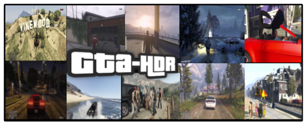

# GTA-HDR
Dataset and code for our newly proposed LDR-HDR dataset: GTA-HDR

## About the project

This joint project is a collaboration between [Monash University, Malaysia campus](https://www.monash.edu.my/) and [Monash University, Melbourne, Australia](https://www.monash.edu/)

Project Members - [Hrishav Bakul Barua](https://www.researchgate.net/profile/Hrishav-Barua)  [(TCS Research, Kolkata)](https://www.tcs.com/research-and-innovation), [Ganesh Krishnasami](https://universe.bits-pilani.ac.in/Hyderabad/bhattacharjee/Profile) [(BITS Pilani, Hyderabad)](https://www.bits-pilani.ac.in/), [Koksheik Wong](https://universe.bits-pilani.ac.in/Hyderabad/bhattacharjee/Profile) [(BITS Pilani, Hyderabad)], [Abhinav Dhall](https://universe.bits-pilani.ac.in/Hyderabad/bhattacharjee/Profile) [(BITS Pilani, Hyderabad)], and [Kalin Stefanov](https://universe.bits-pilani.ac.in/Hyderabad/bhattacharjee/Profile) [(BITS Pilani, Hyderabad)]

### Funding details

## Overview

The official implementation of our GTA-HDR Benchmark Dataset:  
 

## Coming Soon!!

## Our work utilizes the following state-of-the-art models

`HDRCNN` - HDR image reconstruction from a single exposure using deep CNNs (*ACM TOG 2017*), [Code](https://github.com/gabrieleilertsen/hdrcnn)

`DrTMO` - Deep Reverse Tone Mapping (*ACM TOG 2017*), [Code](https://github.com/shleecs/DrTMO_unofficial_pytorch)

`FHDR` - HDR Image Reconstruction from a Single LDR Image using Feedback Network (*GlobalSIP 2019*), [Code](https://github.com/mukulkhanna/FHDR)

`SingleHDR` - Single-Image HDR Reconstruction by Learning to Reverse the Camera Pipeline (*CVPR 2020*), [Code](https://github.com/alex04072000/SingleHDR) 

`HDR-GAN` - HDR Image Reconstruction from Multi-Exposed LDR Images with Large Motions (*IEEE TIP 2021*), [Code](https://github.com/nonu116/HDR-GAN)

`SingleHDR` - Single-Image HDR Reconstruction by Multi-Exposure Generation (*WACV 2023*), [Code](https://github.com/VinAIResearch/single_image_hdr)

`ArtHDR-Net` - Perceptually Realistic and Accurate HDR Content Creation (*APSIPA 2023*), [Code](https://arxiv.org/abs/2309.03827#:~:text=ArtHDR%2DNet%3A%20Perceptually%20Realistic%20and%20Accurate%20HDR%20Content%20Creation,-Hrishav%20Bakul%20Barua&text=High%20Dynamic%20Range%20(HDR)%20content,and%20Augmented%2FVirtual%20Reality%20industries.)

## Our work utilizes the following LDR-HDR datasets

HDR-Eye - Visual attention in LDR and HDR images (VPQM 2015), [Link](https://www.epfl.ch/labs/mmspg/downloads/hdr-eye/)

City Scene, site1 - Learning high dynamic range from outdoor panoramas (ICCV 2017), [Link](https://github.com/jacenfox/ldr2hdr-public) 
           
City Scene, site2- The Laval HDR sky database, [Link](http://hdrdb.com/)
