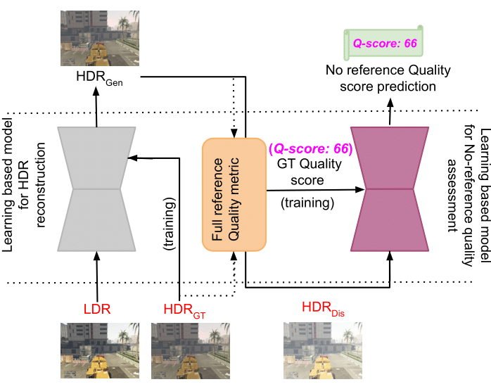
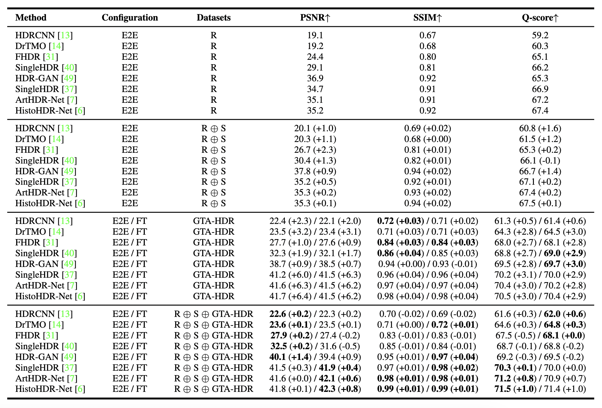
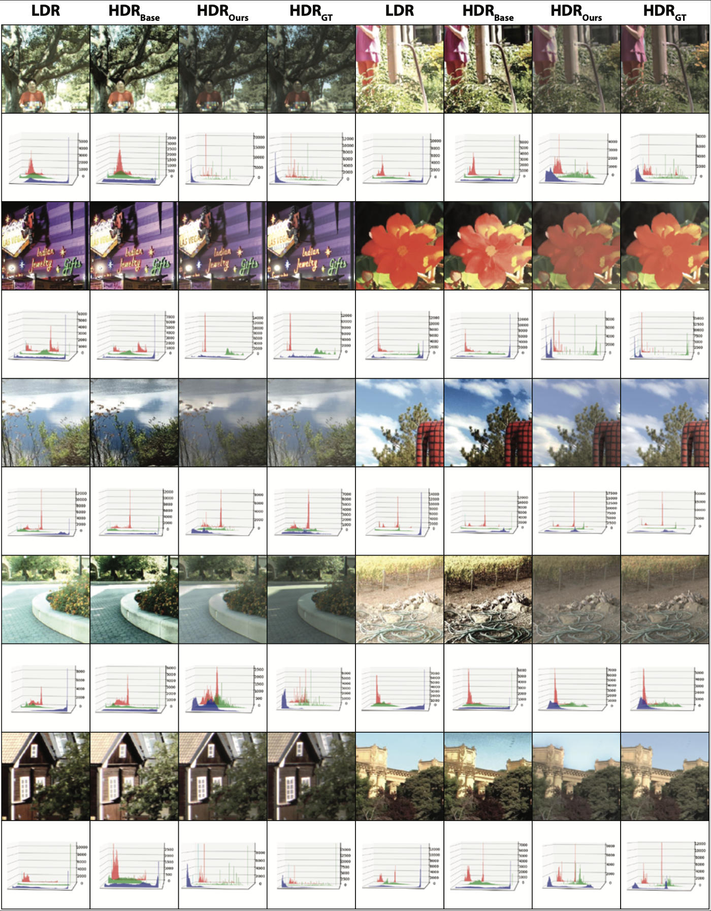

# GTA-HDR: High Dynamic Range Content Creation and Qualtiy Assessment using Deep Learning   

This page contains all the Datasets and Code bases involved in experimenting and establishing our newly proposed LDR-HDR dataset (GTA-HDR) for Deep Learning models.

## About the project

This project is a collaboration between [Monash University, Malaysia campus](https://www.monash.edu.my/) and [Monash University, Melbourne, Australia](https://www.monash.edu/)

Project Members - 

[Hrishav Bakul Barua](https://www.researchgate.net/profile/Hrishav-Barua)  [(Monash University and TCS Research, Kolkata)](https://www.tcs.com/research-and-innovation), 

[Ganesh Krishnasami](https://research.monash.edu/en/persons/ganesh-krishnasamy) [(Monash University, Malaysia)](https://www.monash.edu.my/), 

[KokSheik Wong](https://scholar.google.com/citations?user=oMjrLWcAAAAJ&hl=en) [(Monash University, Malaysia)](https://www.monash.edu.my/), 

[Abhinav Dhall](https://sites.google.com/site/dhallabhinav/) [(Indian Institute of Technology (IIT) Ropar, India and Flinders University, Adelaide, Australia)](https://www.iitrpr.ac.in/) , and 

[Kalin Stefanov](https://research.monash.edu/en/persons/kalin-stefanov) [(Monash University, Melbourne, Australia)](https://www.monash.edu/)

### Funding details

This work is supported by the prestigious [`Global Excellence and Mobility Scholarship (GEMS)`](https://www.monash.edu.my/research/support-and-scholarships/gems-scholarship), Monash University. This research is also supported, in part, by the E-Science fund under the project: *Innovative High Dynamic Range Imaging - From Information Hiding to Its Applications* `(Grant No. 01-02-10-SF0327)`.

## Overview
Given that the performance of any data-driven learning-
based method for HDR image reconstruction largely depends
on the size and diversity of the datasets used for development,
there is a significant gap in the publicly available datasets
required to advance this research direction. Moreover, currently, there are no
available datasets that adequately address the problem of [no-
reference HDR image quality assessment](https://github.com/banterle/NoR-VDPNet) (other [link1](https://github.com/banterle/NoR-VDPNetpp), [link2](https://github.com/fabiocarrara/diqm)), which demands
vast collections of ground truth HDR (HDRGT) 
and distorted HDR (HDRDis)
pairs. In summary, there is a substantial research
gap pertaining to benchmark datasets needed to advance the
research on HDR image reconstruction, motivating the
creation of an appropriate large-scale dataset.

The proposed GTA-HDR dataset
addresses the identified gaps in the current publicly available
datasets for HDR image reconstruction, including: 

1) GTA-HDR is a large-scale (i.e., 40K ground truth HDR images) synthetic dataset sampled from the GTA-V video game data which
utilizes [ray tracing technology](https://books.google.co.in/books?hl=en&lr=&id=YPblYyLqBM4C&oi=fnd&pg=PA1&dq=an+introduction+to+ray+tracing&ots=y156-HnhNb&sig=uEpyVWyaQXveV5nLwkelvyXi4HI&redir_esc=y#v=onepage&q=an%20introduction%20to%20ray%20tracing&f=false) that simulates the physics
behind light and shadows.

2) GTA-HDR includes HDR images
with sufficient resolution (i.e., 512 × 512 and 1024 × 1024).

3) GTA-HDR includes HDR images capturing a diverse
set of scenes including, different locations (e.g., indoor, urban,
rural, in-the-wild), different lighting conditions (e.g., morning,
midday, evening, night), and different weather and season
conditions (e.g., summer, winter, snowy, rainy, sunny, cloudy).

> **_NOTE:_** **The official GTA-HDR Benchmark Dataset is releasing soon!!**  

## Data collection pipeline

| Steps       |    Details/Link     |
| ------------- | ------------- |
|1(a). GTA-V has built-in HDR-10 support for displaying video sequences on HDR displays| The details can be found in [Link1](https://www.adriancourreges.com/blog/2015/11/02/gta-v-graphics-study/), [Link2](https://en.wikipedia.org/wiki/HDR10)|
|1(b). We used Script Hook V plugin to capture HDR frames from the GTA-V game-play sequences |The details can be found in [Link1](http://www.dev-c.com/gtav/scripthookv/), [Link2](https://www.gta5-mods.com/tools/scripthookv-net) |
|1(c). Our pipeline is inspired by the code base adopted from [RenderDoc for Game data (IEEE TIP 2021)](https://ieeexplore.ieee.org/document/9580716) | The details can be found in [Link1](https://github.com/baldurk/renderdoc), [Link2](https://github.com/xiaofeng94/renderdoc_for_game_data) |
|2. We removed frames that are similar to the previous or next frames in the sequence to avoid unnecessary increase in dataset size| We find the [Frame Similarity](https://arxiv.org/abs/1908.07410) using [Chamfer Similarity Metric](https://www.ijcai.org/Proceedings/77-2/Papers/024.pdf): [Link](https://github.com/MKLab-ITI/visil) |
|3(a). We performed transformations on the original LDR images to generate multiple exposure LDR images (i.e., [exposure values](https://arxiv.org/abs/2210.15897) EV 0, ±1, ±2, ±3, and ±4) and different [contrast levels](https://ieeexplore.ieee.org/document/8259342)| For exposure: [Link](https://github.com/VinAIResearch/single_image_hdr) and contrast: [Link](https://github.com/csjcai/SICE)|
|3(b). We also generated distorted HDR images by randomly utilizing state-of-the-art methods|Some of the methods: [M1](https://github.com/marcelsan/Deep-HdrReconstruction), [M2](https://github.com/nonu116/HDR-GAN), [M3](https://github.com/VinAIResearch/PSENet-Image-Enhancement)|

> We stored the final HDR and LDR images in ".hdr" and ".png" formats, respectively

> **_NOTE:_**  Kindly fillup the agreement form to get access to the novel GTA-HDR Dataset used in this work.
  
Please fillup the [Dataset Agreement Form](https://drive.google.com/file/d/1GpJ2Xgn4R43SmUIHLSVpYCCIVTG_FhTC/view?usp=sharing) and mail to [Hrishav Bakul Barua](https://www.researchgate.net/profile/Hrishav-Barua) (hbarua@acm.org) to get access.

## Dataset characteristics

### <ins>Scene diversity</ins>
GTA-HDR dataset scene diversity. Samples from the GTA-HDR dataset with multiple variations in location, weather,
objects and time. The scene diversity ensures a thorough coverage of pixel colors, brightness, and luminance.

### <ins>Image diversity</ins>
GTA-HDR dataset image diversity. For any image-to-image translation dataset, it is important to include a sufficient
amount of samples with diverse range of color hues, saturation, exposure, and contrast levels. The final set of images in the
dataset amounts to a total of 40K × 25 = 1M LDR, 40K HDR, and 40K distorted HDR images.

## Our work utilizes the following:

### <ins>State-of-the-art learning models</ins>

`ACM TOG 2017` | `HDRCNN` - HDR image reconstruction from a single exposure using deep CNNs | [Code](https://github.com/gabrieleilertsen/hdrcnn)

`ACM TOG 2017` | `DrTMO` - Deep Reverse Tone Mapping | [Code](https://github.com/shleecs/DrTMO_unofficial_pytorch)

`GlobalSIP 2019` | `FHDR` - HDR Image Reconstruction from a Single LDR Image using Feedback Network | [Code](https://github.com/mukulkhanna/FHDR)

`CVPR 2020` | `SingleHDR` - Single-Image HDR Reconstruction by Learning to Reverse the Camera Pipeline | [Code](https://github.com/alex04072000/SingleHDR) 

`IEEE TIP 2021` | `HDR-GAN` - HDR Image Reconstruction from Multi-Exposed LDR Images with Large Motions | [Code](https://github.com/nonu116/HDR-GAN)

`WACV 2023` | `SingleHDR` - Single-Image HDR Reconstruction by Multi-Exposure Generation | [Code](https://github.com/VinAIResearch/single_image_hdr)

`APSIPA 2023` | `ArtHDR-Net` - Perceptually Realistic and Accurate HDR Content Creation | [Code](https://arxiv.org/abs/2309.03827#:~:text=ArtHDR%2DNet%3A%20Perceptually%20Realistic%20and%20Accurate%20HDR%20Content%20Creation,-Hrishav%20Bakul%20Barua&text=High%20Dynamic%20Range%20(HDR)%20content,and%20Augmented%2FVirtual%20Reality%20industries.)

 `HistoHDR-Net` - HistoHDR-Net: Histogram Equalization for Single LDR to HDR Image
Translation| [Code](https://arxiv.org/pdf/2402.06692.pdf)

### <ins>LDR-HDR datasets</ins>

`VPQM 2015` | `HDR-Eye` - Visual attention in LDR and HDR images | [Link](https://www.epfl.ch/labs/mmspg/downloads/hdr-eye/)

`ICCV 2017` | `City Scene`, site1 - Learning high dynamic range from outdoor panoramas | [Link](https://github.com/jacenfox/ldr2hdr-public) 
           
`City Scene`, site2- The Laval HDR sky database | [Link](http://hdrdb.com/)

`ACM TOG 2017` | `Kalantari` *et al.* - Deep high dynamic range imaging of dynamic scenes | [Link](https://cseweb.ucsd.edu/~viscomp/projects/SIG17HDR/)

`ACM TOG 2017` | `Endo` *et al.* - Deep reverse tone mapping | [Link](https://www.npal.cs.tsukuba.ac.jp/~endo/projects/DrTMO/)

`ACM TOG 2017` | `Eilertsen` *et al.* - HDR image reconstruction from a single exposure using deep CNNs | [Link](https://computergraphics.on.liu.se/hdrcnn/)

`IEEE Access 2018` | `Lee` *et al.* - Deep chain hdri: Reconstructing a high dynamic range image from a single low dynamic range image | [Link](https://siyeong-lee.github.io/hdr_vds_dataset/)

`IEEE TIP 2018` | `Cai` *et al.* - Learning a deep single image contrast enhancer from multi-exposure images | [Link](https://github.com/csjcai/SICE)

`IEEE ICCP 2019` | `Prabhakar` *et al.* - A fast, scalable, and reliable deghosting method for extreme exposure fusion | [Link](https://github.com/rajat95/Deep-Deghosting-HDR)

`IEEE Access 2020` | `LDR-HDR Pair` - Dynamic range expansion using cumulative histogram learning for high dynamic range image generation | [Link](https://github.com/HanbyolJang/LDR-HDR-pair_Dataset/tree/master)

`CVPR 2020` | `HDR-Synth & HDR-Real` - Single-image HDR reconstruction by learning to reverse the camera pipeline | [Link](https://github.com/alex04072000/SingleHDR)

`SIGGRAPH 2022` | `SI-HDR` - Comparison of single image hdr reconstruction methods — the caveats of quality assessment | [Link](https://www.cl.cam.ac.uk/research/rainbow/projects/sihdr_benchmark/)

Common link to some commonly used datasets - [RAISE (ACM MMSys'15)](https://qualinet.github.io/databases/image/raise___a_raw_images_dataset_for_digital_image_forensics/), HDR-Synth, HDR-Real, and HDR-Eye | [Link](https://github.com/alex04072000/SingleHDR)  

Another huge dataset by [Kim *et al.* (ICCV 2019)](https://github.com/sooyekim/Deep-SR-ITM) (not used in our evaluation due to reasons stated in the paper)

Dataset: [Sen *et al.* (ACM TOG 2012)](https://web.ece.ucsb.edu/~psen/hdrvideo) (not used in our evaluation due to reasons stated in the paper)

Dataset: [Trusun *et al.* (Wiley CGF 2016)](https://user.ceng.metu.edu.tr/~akyuz/files/eg2016/index.html) (not used in our evaluation due to reasons stated in the paper)

### <ins>Dataset summary table</ins>

| Dataset       |    Type     | #HDRGT | Resolution | In-the-wild | HDRDis | Scene diversity | Image diversity |
| ------------- | ------------- | -------------| -------------| -------------| -------------| -------------| -------------| 
| [HDR-Eye (2015)](https://www.epfl.ch/labs/mmspg/downloads/hdr-eye/)  | Synthetic | 46 | 512&cross;512  | :x: | :x: | :x: | :x: |
| [City Scene (2017)](https://github.com/jacenfox/ldr2hdr-public)   | Mixed | 41222 | 128&cross;64|  :x: | :x: | :white_check_mark: | :x: |
|[Kalantari *et al.* (2017)](https://cseweb.ucsd.edu/~viscomp/projects/SIG17HDR/) | Real | 89 | 1500&cross;1000|:x: | :x: | :x: | :x: |
| [Endo *et al.* (2017)](https://www.npal.cs.tsukuba.ac.jp/~endo/projects/DrTMO/) | Synthetic| 1043 |512&cross;512 | :x: | :x: | :x: | :x: |
| [Eilertsen *et al.* (2017)](https://computergraphics.on.liu.se/hdrcnn/)  |Synthetic|96|1024&cross;768| :x: | :x: | :x: | :x: |
| [Lee *et al.* (2018)](https://siyeong-lee.github.io/hdr_vds_dataset/) |Synthetic|96|512&cross;512| :x: | :x: | :x: | :x: |
| [Cai *et al.* (2018)](https://github.com/csjcai/SICE)  |Synthetic|4413|3072&cross;1620| :x: | :x: | :x: | :x: |
| [Prabhakar *et al.* (2019)](https://github.com/rajat95/Deep-Deghosting-HDR)  |Real|582|1200&cross;900| :x: | :x: | :x: | :x: |
| [LDR-HDR Pair (2020)](https://github.com/HanbyolJang/LDR-HDR-pair_Dataset/tree/master)  |Real|176|1024&cross;1024| :x: | :x: | :x: | :x: |
| [HDR-Synth & HDR-Real (2020)](https://github.com/alex04072000/SingleHDR)  |Mixed|20537|512&cross;512| :x: | :x: | :x: | :white_check_mark: |
| [SI-HDR (2022)](https://www.cl.cam.ac.uk/research/rainbow/projects/sihdr_benchmark/)  |Real|181|1920&cross;1280| :x: | :x: | :white_check_mark: | :x: |
| **GTA-HDR (ours)** (2024) | Synthetic |40000|512&cross;512| :white_check_mark: | :white_check_mark: | :white_check_mark: | :white_check_mark: |

 
## Experiments and Results

Impact of the GTA-HDR dataset on the performance of the state-of-the-art in HDR image reconstruction. 
Impact of the GTA-HDR dataset on the performance of the state-of-the-art in HDR image reconstruction. **R**: Real data combines the datasets proposed in [Kalantari *et al.* (2017)](https://cseweb.ucsd.edu/~viscomp/projects/SIG17HDR/), [Prabhakar *et al.* (2019)](https://github.com/rajat95/Deep-Deghosting-HDR), [LDR-HDR Pair (2020)](https://github.com/HanbyolJang/LDR-HDR-pair_Dataset/tree/master)  and the real images from the datasets proposed in [City Scene (2017)](https://github.com/jacenfox/ldr2hdr-public); **R &oplus; S**: This combination contains the mixed datasets (including both real and synthetic data) proposed in [City Scene (2017)](https://github.com/jacenfox/ldr2hdr-public) and the real datasets proposed in [Kalantari *et al.* (2017)](https://cseweb.ucsd.edu/~viscomp/projects/SIG17HDR/), [Prabhakar *et al.* (2019)](https://github.com/rajat95/Deep-Deghosting-HDR), [LDR-HDR Pair (2020)](https://github.com/HanbyolJang/LDR-HDR-pair_Dataset/tree/master); **GTA-HDR**: Proposed synthetic dataset; **E2E**: End-to-end training; **FT**: Finetuning of the original pre-trained models. The performance of all methods is evaluated on a separate dataset proposed in [HDR-Synth & HDR-Real (2020)](https://github.com/alex04072000/SingleHDR).

For more details and experimental results please check out the paper!!

HDR images reconstructed with and without GTA-HDR as part of the training dataset, along with the RGB histograms and *KL-divergence* values. **Base**: HDR images reconstructed with [ArtHDR-Net](https://arxiv.org/abs/2309.03827#:~:text=ArtHDR%2DNet%3A%20Perceptually%20Realistic%20and%20Accurate%20HDR%20Content%20Creation,-Hrishav%20Bakul%20Barua&text=High%20Dynamic%20Range%20(HDR)%20content,and%20Augmented%2FVirtual%20Reality%20industries.)
 trained without GTA-HDR data; **Ours**: HDR images reconstructed with [ArtHDR-Net](https://arxiv.org/abs/2309.03827#:~:text=ArtHDR%2DNet%3A%20Perceptually%20Realistic%20and%20Accurate%20HDR%20Content%20Creation,-Hrishav%20Bakul%20Barua&text=High%20Dynamic%20Range%20(HDR)%20content,and%20Augmented%2FVirtual%20Reality%20industries.)
 trained with GTA-HDR data; **GT**: Ground truth.

For more details and experimental results please check out the paper!!

A page for awsome Deep Learning based HDR Reconstruction models: [Link1](https://github.com/vinthony/awesome-deep-hdr), [Link2](https://github.com/rebeccaeexu/Awesome-High-Dynamic-Range-Imaging?tab=readme-ov-file) 

A page for awsome Deep Learning based Underexposed Image Enhancement models: [Link](https://github.com/dawnlh/awesome-low-light-image-enhancement) 

